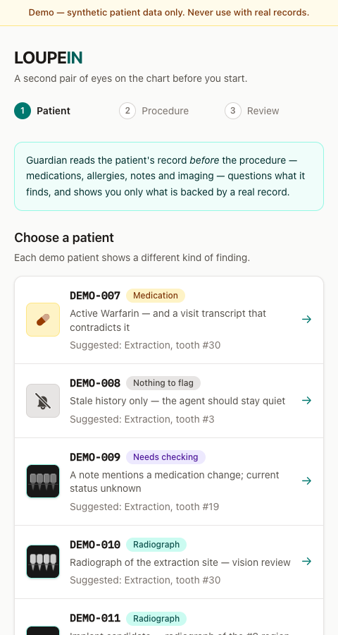
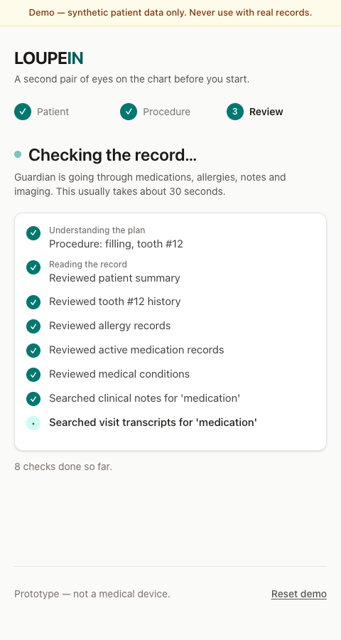
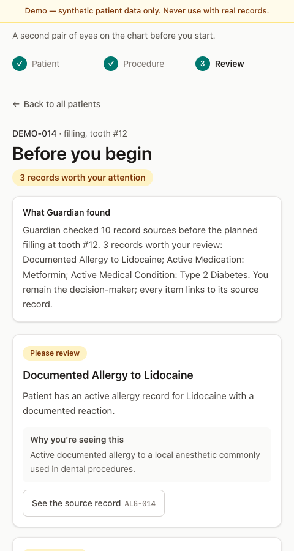
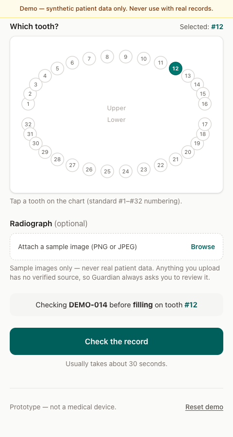

<div align="center">

# LOUPEIN

### **Before you begin, let the record challenge the plan.**

[](docs/WRITEUP.md)
[](docs/PROVENANCE.md)
[](https://github.com/agenticLoupes/agenticloop/actions/workflows/ci.yml)

*A dentist says what they are about to do. Four agents go into the chart first, argue about what they found, and show only what a real record backs.*

[**Demo**](#see-it-run) · [**Quick Start**](#quick-start) · [**How it works**](#how-it-works) · [**Demo script**](docs/DEMO_SCRIPT.md)

</div>

<p align="center">
  
  
  
</p>

One command proves the whole loop against the live agents. It starts both services, drives a filling on tooth 12 for patient DEMO-014, and saves the trace and cards under `.verify/evidence/`:

```bash
.claude/skills/verify-dentassist/scripts/verify.sh launch && .claude/skills/verify-dentassist/scripts/verify.sh drive DEMO-014 filling 12
```

> **Proof of concept, not a diagnostic device.** Every patient is hand-authored synthetic data. The dentist stays the decision-maker.

## The problem everyone ignores

Dental software stores everything and volunteers nothing. Allergies, anticoagulants, a note from three visits ago that says "patient reports stopping Warfarin," a radiograph nobody reopened. It is all there, and it all waits for the clinician to go looking, gloves on, patient in the chair, ten minutes behind schedule.

Chart summaries do not fix this. A summary of a whole record is either too long to read chairside or too short to be trusted. And an "alert" system that flags everything trains everyone to click past it.

## The insight

The useful question is not "what is in this chart?" It is **"given what I am about to do, what in this chart deserves a second look?"** That question has a procedure and a tooth in it, which means an agent can investigate instead of summarize: open the records that matter for an extraction on tooth 19, follow a finding into the note that mentions it, and stop when the evidence runs out.

The second half of the insight is that one agent is not enough. The agent that finds things is biased toward finding things. So a second agent argues against every candidate, and a card only reaches the screen if it survives. When nothing survives, LOUPEIN says nothing. Silence is a result.

## The solution


Four agents, one request:

1. **Context Interpreter** turns "filling, tooth 12" into an investigation plan.
2. **Guardian Investigator** runs a ReAct loop over nine deterministic record tools. It decides what to open next based on what it just read.
3. **Skeptic / Verifier** challenges each candidate and returns one of three verdicts: SURFACE, DISMISS, or VERIFY.
4. **Assist Composer** formats the survivors into cards. It adds no advice.

Every card carries the id of the row it came from, and the app opens that row on tap.

## See it run

The three demo patients from the [demo script](docs/DEMO_SCRIPT.md), as they ran on the current main during rehearsal:

| Patient | Ask | What comes back | Time |
| --- | --- | --- | --- |
| DEMO-014 | filling, tooth 12 | Three **Please review** cards: documented Lidocaine allergy, active Metformin, Type 2 diabetes. | 16 s |
| DEMO-009 | extraction, tooth 19 | A **Worth verifying** card: a note reports a blood-thinner change and no medication row confirms it. LOUPEIN says verify, not guess. | 17 s |
| DEMO-008 | extraction, tooth 3 | Nothing. Only stale history in the chart, so the agent stays quiet. | 7 s |

<p align="center">
  
</p>

There is also a hands-free path. Open `/live` on a phone, press Go live, and say "I'm doing a filling on tooth twelve." Gemini Live is the ears and mouth; the same Guardian pipeline does the work, and the cards appear on the laptop.

## Features

| Feature | What it means for the dentist |
| --- | --- |
| Investigates, does not summarize | The agent chooses which records to open for this procedure and this tooth. |
| A second agent argues back | Every candidate is challenged before it becomes a card. Fewer, better cards. |
| Silence is a valid answer | When nothing survives, the screen says so instead of inventing a warning. |
| Verify, not guess | A finding the record cannot confirm is marked "Worth verifying," never asserted. |
| Every card has a source | Tap any card and the underlying record opens, with its id. |
| Live trace while it works | You watch the agent read the chart step by step, so the result is not a black box. |
| Hands-free voice | Gloves on, phone on the counter, results on the laptop. |
| Imaging and transcripts | Radiographs and prior-visit transcripts are records too, and the Guardian reads them. |

## Quick start

You need Python 3.12, [uv](https://docs.astral.sh/uv/), and Node.js with npm. Use npm for the frontend; bun's isolated layout breaks Turbopack's PostCSS resolution here.

```bash
git clone https://github.com/agenticLoupes/agenticloop.git && cd agenticloop
cp backend/.env.example backend/.env   # set SUPABASE_DB_URL, GOOGLE_API_KEY, GEMINI_MODEL, TYPESAFE_API_KEY
uv venv -p 3.12 backend/.venv
uv pip install -p backend/.venv/bin/python -e "backend[dev]"
(cd frontend && npm ci && npm run build)
```

Run it:

```bash
(cd backend && .venv/bin/uvicorn app.main:app --port 8000)   # terminal 1
(cd frontend && npm run start)                                # terminal 2
```

Open [http://localhost:3000](http://localhost:3000). Health check: [http://localhost:8000/health](http://localhost:8000/health).

One trap: if your shell exports `GOOGLE_API_KEY` or `GEMINI_API_KEY`, that value overrides `backend/.env`. Unset it, or use the verification helper, which unsets it for the backend process:

```bash
.claude/skills/verify-dentassist/scripts/verify.sh launch    # start both, wait for ready
.claude/skills/verify-dentassist/scripts/verify.sh doctor    # is this instance worth driving?
.claude/skills/verify-dentassist/scripts/verify.sh drive DEMO-009 extraction 19
.claude/skills/verify-dentassist/scripts/verify.sh cleanup   # kills only what it started
```

## How it works

- **Frontend:** [Next.js 16](https://nextjs.org/), React 19, Tailwind 4. Phone-width by design; the `/live` page adds mic and camera through the [Gemini Live API](https://ai.google.dev/gemini-api/docs/live).
- **API:** [FastAPI](https://fastapi.tiangolo.com/). `POST /investigations` returns a run id immediately and the agents work in the background; the UI polls `/trace` for the step-by-step log and `/investigations/{id}` for the result.
- **Agents:** [LangGraph](https://langchain-ai.github.io/langgraph/) orchestrates the four agents. [Gemini](https://ai.google.dev/) drives the Guardian's ReAct loop through `langchain-google-genai`.
- **Skeptic verdicts:** [TypeSafe Jev](https://typesafe.ai/) returns a typed SURFACE, DISMISS, or VERIFY decision per candidate, so the verdict is data, not prose.
- **Records:** [Supabase](https://supabase.com/) Postgres, ten tables of synthetic patients, medications, allergies, conditions, notes, imaging, and transcripts. The Guardian never writes SQL; it calls nine deterministic query tools, and every tool result carries the row id that ends up on the card.
- **Trace:** every run writes an event per step (`context`, `tool_call`, `candidates`, `challenge`, `decision`, `cards`) so the UI, the tests, and the verification harness all read the same log.

## The story

This was built in one day at a hackathon by a team that includes a working dental operator. The first plan was a real-time loupes overlay. Halfway through the afternoon the team force-pushed a different product over it, because the overlay was a demo and this was a workflow: the moment before a procedure, when the chart is open and nobody has time to read it.

The most argued-over decision was the Skeptic. Removing it makes the demo flashier, since more cards appear. Keeping it is the point. During the twelve-patient sweep, one patient produced nine candidates and six cards on the first run and five candidates and four cards on the second, which is exactly the kind of variance a second agent exists to catch. That finding is filed as an issue, not hidden.

## Known limitations

- Tool selection and reasoning have not been validated on real clinical records.
- The Skeptic is an LLM judge, not a clinical rule engine, and runs are not fully deterministic.
- Uploaded radiographs have no authored ground truth and can only produce VERIFY results.
- No authentication, audit log, tenant isolation, or de-identifying gateway. Single-tenant demo database.

Before any clinical use: prospective validation, security and privacy controls, auditability, and integration with governed clinical data sources.

## Docs

- [Demo script](docs/DEMO_SCRIPT.md), word for word, with rehearsal timings
- [Scenario sweep](docs/SCENARIOS.md), all twelve patients through the real agents
- [Provenance ledger](docs/PROVENANCE.md), who authored every record and image
- [Agents Track write-up](docs/WRITEUP.md)

---

<div align="center">

If the idea of an agent that argues with itself before it talks to a clinician is interesting to you, star the repo and open an issue with the record you would want it to catch.

</div>
